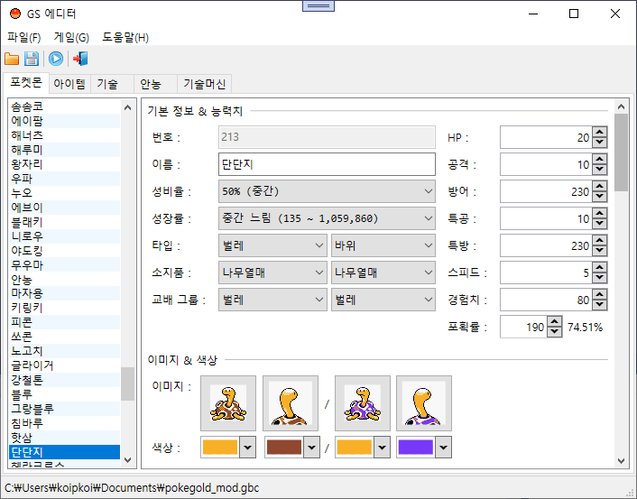
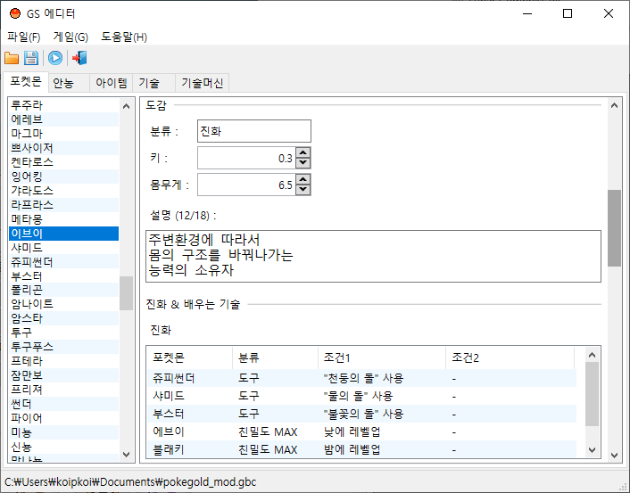

# GSEditor

포켓몬스터 골드 버전 에디터입니다.

## 기능

* 포켓몬 편집
* 안농 편집
* 아이템 편집
* 기술 편집

## 미리보기

## 라이선스

[GSEditor](./LICENSE.md)는 MIT입니다.

### 1. [MIT](./Docs/Licenses/mit.md)

* MdXaml
* Newtonsoft.Json & Bson
* PresentationTheme.Aero
* Microsoft.Extensions.DependencyInjection

### 2. [MS-PL](./Docs/Licenses/ms-pl.md)

* Wpf.Toolkit
* XAMLMarkupExtensions

### 3. [Creative Commons](https://creativecommons.org/licenses/by/3.0)

* [16x16 Free Application Icons icon pack](https://www.iconfinder.com/iconsets/6x16-free-application-icons)
